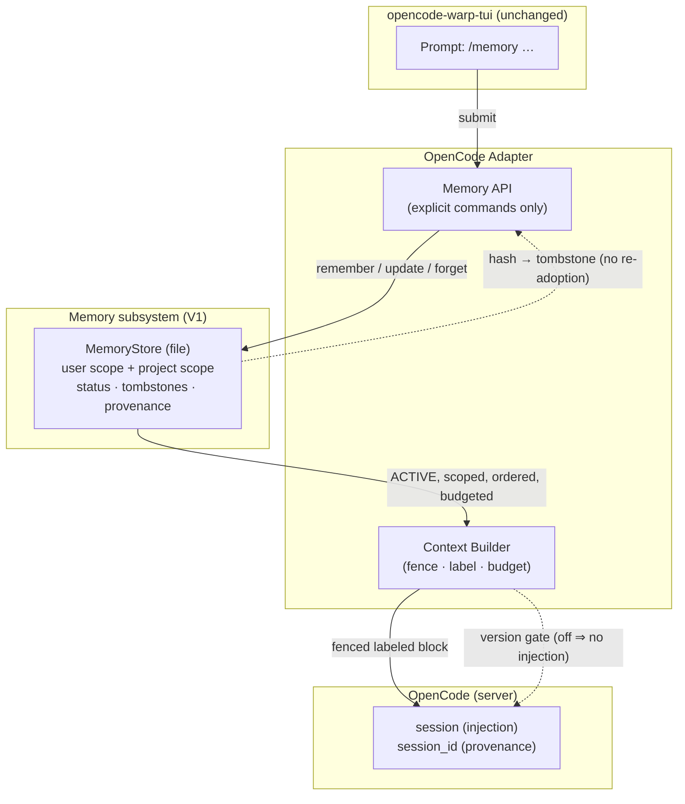

# Memory Research Phase 2A — Minimal Architecture (proposal)

> Status: 🔬 RESEARCH ONLY — candidate for Phase 2B review. **Nothing here
> is implemented.** This document is intentionally smaller than
> `architecture.md` (§34–§37, Phase 1): it contains only what survives the
> minimality review in `phase2a-memory-model.md`.

---

## 1. Final candidate components

Exactly three components in V1:

| # | Component | Responsibility |
|---|---|---|
| 1 | **Memory API** | Accept explicit user memory commands (`remember`, `update`, `forget`, `list`, `show`) at the adapter boundary; refuse secrets; the only ingestion path |
| 2 | **MemoryStore** (trait) | Persist records per scope (user / project); status transitions; tombstones; ordered, budgeted reads of ACTIVE rows |
| 3 | **Context Builder** | Render the scoped ACTIVE corpus as one fenced, labeled, char-budgeted block for session-start injection; version-gated boundary |

Deliberately **absent** in V1: Capturer-as-event-listener, Extractor,
Retriever, Consolidator, entity subsystem, separate Tier-1 layer,
SQLite/FTS5, all score fields. Each returns as a growth path behind an
existing interface (see §7).

---

## 2. Boundaries

```text
┌────────────────────────────────────────────────────────────────┐
│ TUI (unchanged; Phase 9 adds /memory UI)                       │
└──────────────┬─────────────────────────────────────────────────┘
               │  existing Backend trait (submit / commands)
┌──────────────▼─────────────────────────────────────────────────┐
│ OpenCode Adapter                                               │
│   · routes /memory commands to the Memory API                  │
│   · asks Context Builder for the injection block at            │
│     session start                                              │
└──┬───────────────────────┬─────────────────────────────────────┘
   │                       │
   │ /memory command       │ version-gated injection
   ▼                       ▼
┌──────────────┐   ┌───────────────┐   ┌────────────────────────┐
│ Memory API   │──►│ MemoryStore   │◄──│ Context Builder        │
│ (commands,   │   │ (file-backed, │   │ (fence + label +       │
│  secrets n/a)│   │  user+project)│   │  budget)               │
└──────────────┘   └───────────────┘   └───────────┬────────────┘
                                                   │
                                                   ▼
                              OpenCode session (supported, gated boundary)
```

- The TUI never sees memory types; the adapter never leaks memory into the
  generic `Backend` vocabulary beyond what Phase 9 adds.
- Memory is **off the critical path**: commands fail visibly, injection
  degrades to nothing — OpenCode turns are unaffected (§16 of
  `phase2a-memory-model.md`).

---

## 3. Data flow

Five steps:

1. **Command** — user issues `/memory remember <text>` (or update/forget)
   in the TUI prompt; the adapter routes it to the Memory API (active
   session id is already known — no new OpenCode surface).
2. **Validate** — secret-pattern refusal; scope default = project;
   kind default = fact; optional `key` for updates.
3. **Store** — record `{text, kind, scope, source=user, key?, tags?,
   session_id, source_ref, quote≤256, status, created_at}` appended to the
   scope's store file; tombstones honored; same-key write supersedes.
4. **Build context** — at session start (frozen per session), Context
   Builder reads ACTIVE rows for the current project + user, orders
   pinned-then-recency, truncates to the char budget, and renders the
   fenced, labeled block.
5. **Inject** — the block is handed to the version-gated injection
   boundary (chosen in Phase 2B); absence/drift ⇒ no injection.

---

## 4. Memory lifecycle

```text
          explicit remember          explicit same-key update
                │                            │
                ▼                            ▼
   ACTIVE ──┬─────────────────────────► SUPERSEDED (kept, excluded from injection)
            │
            └── explicit forget ──► DELETED + tombstone(hash, deleted_at)
```

- Never silent overwrite; supersession retains the old row.
- CONFLICT is defined for V2 (machine extraction) and unreachable in V1.
- Only ACTIVE rows are ever injected.

---

## 5. Scope flow

```text
user store (machine-level dir)      project store (inside the repo dir)
   · preferences, profile facts        · decisions, conventions, repo facts
   · injected in every project         · injected only for this project
   · promotion: NONE automatic         · promotion to user: explicit command only
```

Isolation is structural: each repository owns a separate store file, so
Project A's knowledge cannot be queried from Project B. Session id appears
only in provenance.

---

## 6. Failure flow

| Event | Behavior |
|---|---|
| Store read/append fails | visible error for the command; injection skipped; turns unchanged |
| Corrupt/malformed row | skip row + log; serve rest |
| Injection boundary missing/drifted | gate off; no injection; turns unchanged |
| Secret-pattern match | command refused with message; nothing stored |
| Prompt-injection-like memory text | treated as **data, not instructions**: fenced + labeled, never executed |

---

## 7. Extension points (interfaces now, code later)

1. **`MemoryStore` trait** — V2 can add an SQLite+FTS5 implementation
   behind the same queries `{scope, status=ACTIVE, order=pinned/recency}`
   without touching the Context Builder or API.
2. **Injection boundary config + version gate** — decided in 2B; V1 ships
   it off by default.
3. **Tombstone `hash`** — ready for V2 dedup/extraction so deleted facts
   are never re-adopted.
4. **Extractor seam (V2/V3)** — rules/LLM producers write the same record
   shape through the same API, gated by ASK/opt-in.
5. **Sidecar port (V3)** — embeddings/graph live behind the store trait as
   a future remote implementation (Option C).

---

## 8. Mermaid diagram



---

## 9. What this buys

- **V1 is tiny**: one file store, three modules, no new dependencies, no
  OpenCode modification, no experimental hooks.
- **V2 slots in**: SQLite/FTS5 + rules extraction + retrieval behind the
  same trait and command surface.
- **V3 stays optional**: embeddings/graph sidecar only when actually
  wanted.
- The architecture can be explained in one diagram and five steps, and it
  preserves every hard constraint (local-first, adapter-isolated, graceful
  failure, explainable).

---

## 10. Non-goals (explicit)

- No automatic capture, extraction, or ranking in V1.
- No SQLite/FTS5/embeddings/vector in V1.
- No new OpenCode surface; no TUI changes (Phase 9 adds the UI for the
  already-existing command API).
- No memory without user request; no stored scores; no session-scoped
  memories.
- No audit trail of deleted content in V1.